# Documentation technique — Gestion Commerciale

**Projet personnel** — Développé de manière indépendante par Kounadi
**Dépôt :** https://github.com/meitekounaditeguera/GestionCommerciale

---

## Sommaire

1. [Introduction](#1-introduction)
2. [Architecture générale](#2-architecture-générale)
3. [Modèle de données](#3-modèle-de-données)
4. [Sécurité et gestion des rôles](#4-sécurité-et-gestion-des-rôles)
5. [Diagrammes de séquence](#5-diagrammes-de-séquence)
6. [Diagramme d'activité](#6-diagramme-dactivité-cycle-de-vente-et-de-réapprovisionnement)
7. [Captures d'écran commentées](#7-captures-décran-commentées)
8. [Choix techniques et difficultés rencontrées](#8-choix-techniques-et-difficultés-rencontrées)
9. [Perspectives d'évolution](#9-perspectives-dévolution)

---

## 1. Introduction

### 1.1 Contexte

**Gestion Commerciale** est une application web de gestion commerciale, de stock et de suivi d'activité, conçue et développée de manière indépendante avec une architecture pensée comme en entreprise : séparation claire des responsabilités entre l'API et l'interface, sécurité par rôles, traçabilité complète des actions et documentation de l'API.

Ce document présente l'architecture technique complète de l'application : son organisation logicielle, son modèle de données, les flux métier critiques sous forme de diagrammes, une revue commentée de l'ensemble des écrans, ainsi que les choix techniques retenus et les difficultés résolues durant le développement.

### 1.2 Objectifs de l'application

L'application couvre l'ensemble du cycle d'une activité commerciale :

- **Clients** : création, modification, suppression logique, recherche, export
- **Catalogue produits** : gestion des produits, catégories, prix, stock, codes-barres / QR codes
- **Ventes** : prise de commande, calcul automatique, facturation PDF
- **Achats fournisseurs** : commandes avec flux de validation et réception, mise à jour automatique du stock
- **Pilotage** : tableau de bord avec indicateurs financiers, graphiques, alertes de stock
- **Sécurité et traçabilité** : authentification JWT, rôles applicatifs, journal d'audit complet

### 1.3 Stack technique

| Couche | Technologies |
|---|---|
| **Backend** | Java 21, Spring Boot, Spring Security (JWT), Spring Data JPA, Maven |
| **Base de données** | PostgreSQL |
| **Documentation API** | springdoc-openapi (Swagger UI) |
| **Frontend** | Angular (composants standalone), TypeScript, Bootstrap 5 |
| **Graphiques** | Chart.js / ng2-charts |
| **Scan code-barres / QR** | html5-qrcode (webcam) |
| **Facturation PDF** | jsPDF + jspdf-autotable (génération côté client, à l'usage immédiat) et OpenPDF (génération côté serveur, pour l'archivage — voir §5.7) |
| **Export tabulaire** | ExcelJS |
| **Notifications** | Spring Mail (SMTP) + job planifié (`@Scheduled`) |
| **Tests** | JUnit 5 / Mockito / AssertJ (backend), Vitest via le builder natif `@angular/build:unit-test` (frontend) |
| **Intégration continue** | GitHub Actions (compilation, tests, packaging) |

---

## 2. Architecture générale

### 2.1 Vue d'ensemble

L'application suit une architecture **3-tiers classique**, avec une séparation stricte entre la présentation (Angular), la logique métier exposée en API REST (Spring Boot) et la persistance (PostgreSQL). L'authentification repose sur un token **JWT** transmis à chaque requête, sans état de session côté serveur (API stateless).

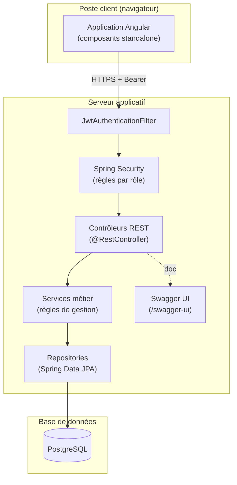

### 2.2 Organisation du backend (architecture en couches)

Le backend suit une architecture en couches, package par responsabilité :

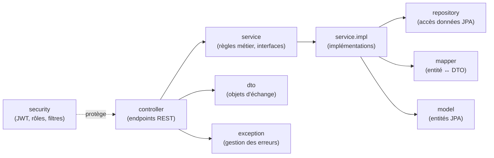

**Packages backend :**

| Package | Rôle |
|---|---|
| `controller` | Expose les endpoints REST (8 contrôleurs : Auth, Client, Produit, Commande, CommandeFournisseur, Fournisseur, Stock, Dashboard, AuditLog) |
| `service` / `service.impl` | Contient les règles de gestion (calcul de montant, vérification de stock, transitions de statut) |
| `repository` | Interfaces Spring Data JPA pour l'accès à PostgreSQL |
| `model` | Entités JPA (13 entités métier) |
| `dto` | Objets de transfert entre l'API et le frontend, découplés des entités |
| `mapper` | Conversion entité ↔ DTO |
| `security` | Filtre JWT, configuration Spring Security, gestion des rôles |
| `exception` | Exceptions métier dédiées (ex. `StockInsuffisantException`, `FactureNotFoundException`) et gestion centralisée des erreurs HTTP |
| `scheduler` | Jobs planifiés (`@Scheduled`) — actuellement l'alerte de stock quotidienne |

### 2.3 Organisation du frontend

Le frontend Angular est structuré en **composants standalone**, un par domaine fonctionnel, avec des services dédiés à la communication HTTP et des guards pour la protection des routes.

```
frontend/src/app/
├── components/
│   ├── login/                  # Écran de connexion
│   ├── layout/                 # Barre de navigation, thème clair/sombre
│   ├── home/                   
│   ├── dashboard/              # Tableau de bord (KPIs, graphiques, alertes)
│   ├── client-list/            # Gestion des clients
│   ├── produit-list/           # Catalogue produits
│   ├── scanner-code-barres/    # Composant de scan webcam réutilisable
│   ├── commande-list/          # Prise de commande & liste des ventes
│   ├── fournisseur-list/       # Gestion des fournisseurs
│   ├── commande-fournisseur/   # Commandes d'achat & réception
│   ├── historique-stock/       # Historique des mouvements de stock
│   └── audit-logs/             # Journal d'audit
├── services/                   # Un service HTTP par domaine + services transverses
│   ├── auth.service.ts
│   ├── facture-pdf.service.ts  # Génération de factures PDF (jsPDF)
│   ├── excel-export.service.ts # Export Excel (ExcelJS)
│   ├── data-refresh.service.ts # Synchronisation entre composants
│   └── theme.service.ts        # Thème clair / sombre
├── guards/
│   ├── auth.guard.ts           # Bloque l'accès si non authentifié
│   └── role.guard.ts           # Bloque l'accès selon le rôle
├── interceptors/
│   └── jwt.interceptor.ts      # Attache automatiquement le token JWT
└── models/                     # Interfaces TypeScript (miroir des DTO backend)
```

**Points clés :**
- Le `jwt.interceptor.ts` attache automatiquement l'en-tête `Authorization: Bearer <token>` à toute requête vers l'API, sans dupliquer cette logique dans chaque service.
- Le composant `scanner-code-barres` est mutualisé : il est utilisé à la fois dans le catalogue produits (recherche) et dans la prise de commande (ajout rapide d'un produit).
- Les guards (`auth.guard`, `role.guard`) empêchent l'accès à une route côté client selon l'authentification et le rôle, en complément (et non en remplacement) du contrôle réel effectué côté serveur par Spring Security.

---

## 3. Modèle de données

### 3.1 Diagramme de classes

Le modèle de données est composé de 13 entités JPA. Les tables `commandes` (ventes) et `commandes_fournisseurs` (achats) suivent le même schéma composition (commande / ligne / produit), mais sont volontairement séparées car elles portent des règles de gestion différentes (une vente décrémente le stock immédiatement, un achat ne l'incrémente qu'à la réception).

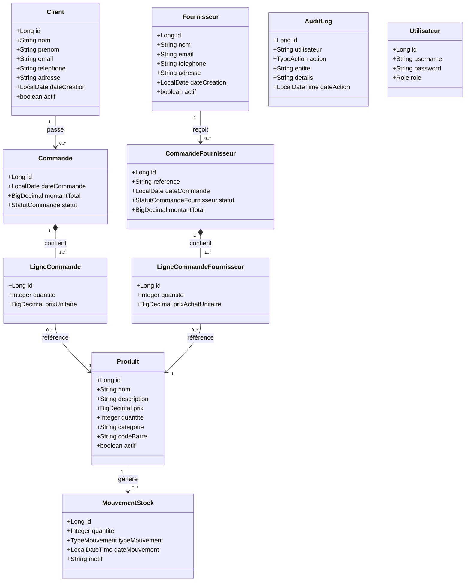

**Énumérations métier :**

| Enum | Valeurs | Usage |
|---|---|---|
| `StatutCommande` | `VALIDE`, `ANNULE` | Cycle de vie d'une commande client |
| `StatutCommandeFournisseur` | `BROUILLON`, `VALIDEE`, `LIVREE`, `ANNULEE` | Cycle de vie d'une commande fournisseur |
| `TypeMouvement` | `ENTREE`, `SORTIE` | Sens d'un mouvement de stock |
| `TypeAction` | `CREATION`, `MODIFICATION`, `SUPPRESSION` | Type d'action journalisée dans l'audit |
| `Role` | `ADMIN`, `GESTIONNAIRE`, `CAISSIER` | Rôle applicatif de l'utilisateur |

### 3.2 Choix de conception notables

- **Suppression logique (soft delete)** : `Client`, `Produit` et `Fournisseur` possèdent un champ `actif`. Une « suppression » désactive l'enregistrement au lieu de le retirer physiquement de la base. Cela garantit que les commandes passées restent consultables (la clé étrangère `client_id` / `produit_id` reste valide) et qu'une suppression ne peut plus jamais échouer avec une erreur d'intégrité référentielle (HTTP 409).
- **Prix figé à la ligne de commande** : `LigneCommande.prixUnitaire` et `LigneCommandeFournisseur.prixAchatUnitaire` copient le prix au moment de la transaction plutôt que de le lire dynamiquement depuis `Produit`. Ainsi, une modification ultérieure du prix catalogue n'altère jamais le montant d'une commande déjà passée.
- **Cascade sur les lignes** : `Commande` et `CommandeFournisseur` déclarent `cascade = CascadeType.ALL, orphanRemoval = true` sur leurs lignes : la persistance, la mise à jour et la suppression des lignes suivent automatiquement celles de la commande parente.
- **Référence lisible pour les commandes fournisseurs** : chaque `CommandeFournisseur` reçoit une référence générée côté serveur au format `CF-<année>-<séquence>` (ex. `CF-2026-0007`), plus lisible qu'un identifiant technique pour un usage métier (bons de commande, échanges avec le fournisseur).
- **Journal d'audit en écriture seule** : une fois créée, une ligne `AuditLog` n'est plus jamais modifiée ni supprimée par l'application — elle ne porte donc aucun setter métier au-delà de la construction initiale, afin de garantir l'intégrité de la trace.

---

## 4. Sécurité et gestion des rôles

### 4.1 Authentification par JWT

L'application n'utilise aucune session côté serveur (`SessionCreationPolicy.STATELESS`). Chaque requête protégée doit porter un token JWT dans l'en-tête `Authorization: Bearer <token>`, vérifié par un filtre dédié (`JwtAuthenticationFilter`) exécuté avant le filtre d'authentification standard de Spring Security.

### 4.2 Rôles applicatifs

Trois rôles sont définis, avec des permissions strictement différenciées, appliquées **côté serveur** dans `SecurityConfig` (les guards Angular ne sont qu'un confort d'interface, pas une garantie de sécurité) :

| Rôle | Périmètre d'accès |
|---|---|
| **ADMIN** | Accès complet : tableau de bord, stock, achats, suppression de données, journal d'audit |
| **GESTIONNAIRE** | Tableau de bord, stock, fournisseurs, achats et commandes — sans suppression ni accès au journal d'audit |
| **CAISSIER** | Prise de commande et facturation uniquement |

**Règles d'autorisation par ressource :**

| Ressource / méthode | Rôles autorisés |
|---|---|
| `DELETE /api/clients`, `/api/produits`, `/api/commandes` | `ADMIN` uniquement |
| `/api/dashboard/**` | `ADMIN`, `GESTIONNAIRE` |
| `/api/stock/**` | `ADMIN`, `GESTIONNAIRE` |
| `/api/commandes/**` (hors suppression) | `ADMIN`, `GESTIONNAIRE`, `CAISSIER` |
| `/api/fournisseurs/**`, `/api/commandes-fournisseurs/**` | `ADMIN`, `GESTIONNAIRE` |
| `/api/audit-logs/**` | `ADMIN` uniquement |
| `/api/notifications/**` | `ADMIN` uniquement |
| `/auth/**`, `/swagger-ui/**`, `/v3/api-docs/**` | Public (sans authentification) |

**Illustration — tentative d'accès à une route non autorisée**

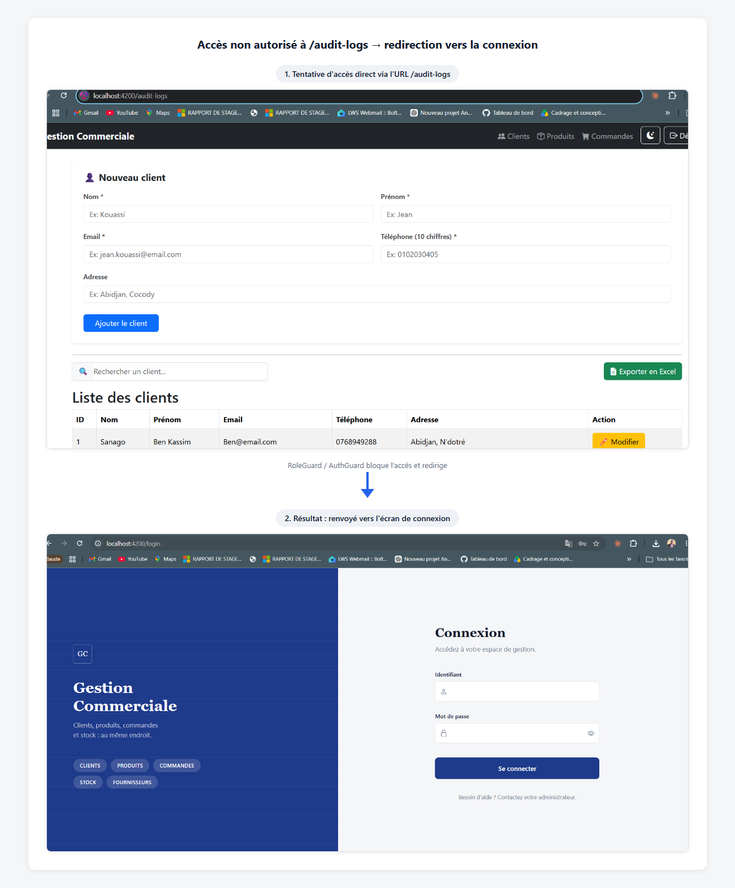

Un utilisateur connecté avec un rôle insuffisant qui tente d'accéder directement à `/audit-logs` par l'URL est intercepté côté client par `role.guard.ts` et redirigé avant que le composant protégé ne soit rendu. Ce comportement est vérifié par un test automatisé (`role.guard.spec.ts`) et reste une protection d'ergonomie : la garantie de sécurité réelle est appliquée côté serveur par `SecurityConfig`, qui rejetterait de toute façon la requête API sous-jacente avec un code 403 si le guard client était contourné.

### 4.3 Traçabilité

Chaque création, modification ou suppression sur les entités métier (`Client`, `Produit`, `Fournisseur`, `Commande`, `CommandeFournisseur`) déclenche l'enregistrement d'une ligne dans le journal d'audit (`AuditLogService.enregistrer(...)`), avec l'utilisateur à l'origine de l'action, l'entité concernée, un horodatage et une description lisible de l'action effectuée.

---

## 5. Diagrammes de séquence

Cette section détaille les six flux fonctionnels les plus représentatifs de l'application.

### 5.1 Authentification (connexion et accès à une ressource protégée)

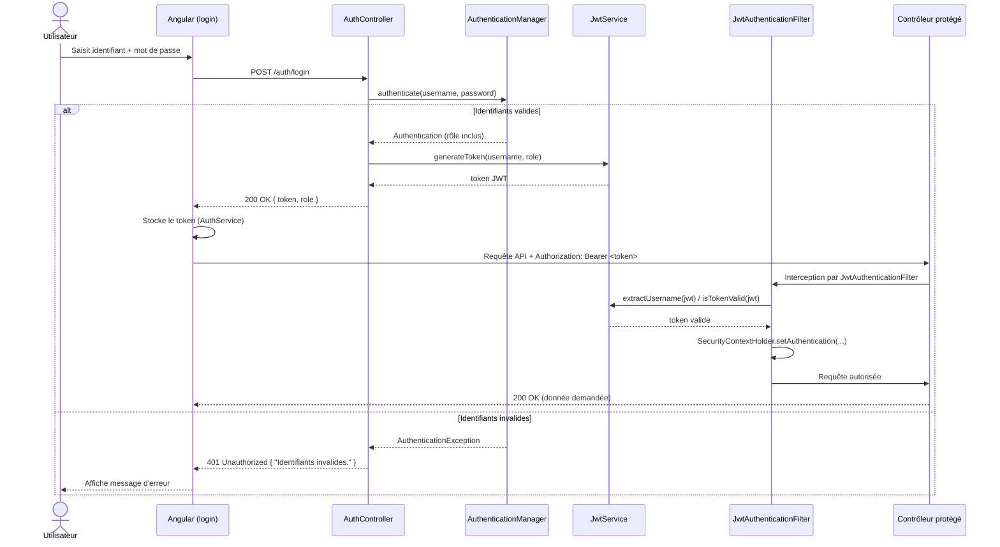

### 5.2 Prise de commande avec scan produit et facturation PDF

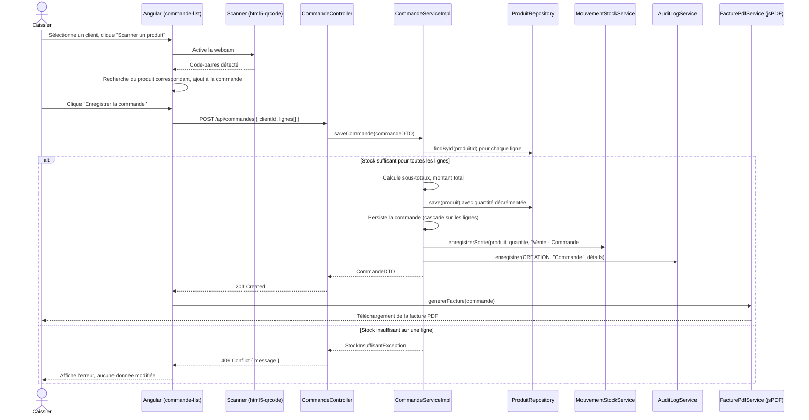

### 5.3 Annulation d'une commande client (restitution du stock)

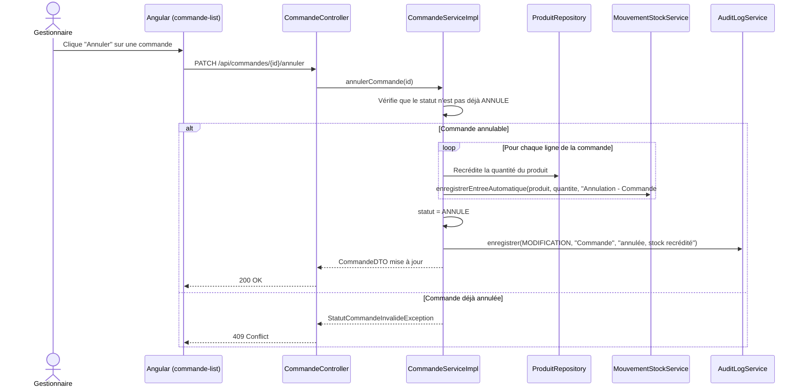

### 5.4 Commande fournisseur : création, validation et réception

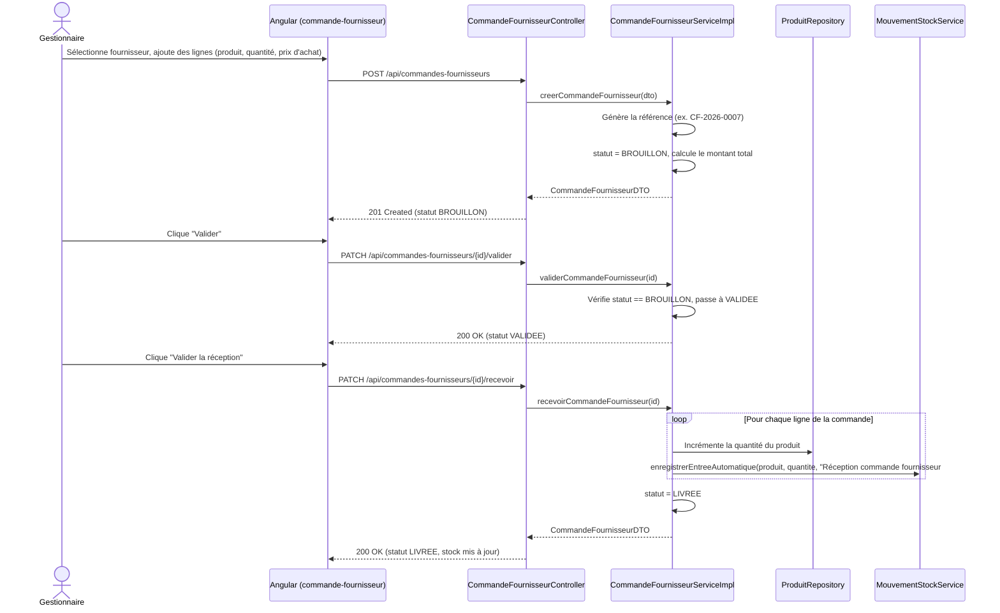

### 5.5 Détection des alertes de stock et estimation du délai avant rupture (tableau de bord)

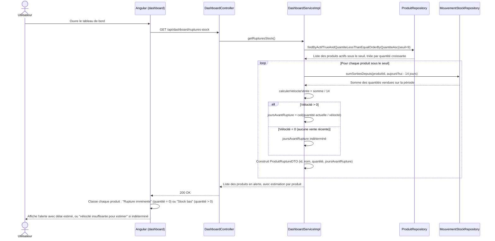

**Note sur la formule retenue :** la vélocité de vente est une moyenne glissante simple (quantité totale sortie sur 14 jours ÷ 14), sans pondération ni lissage. Elle ne tient donc pas compte de la saisonnalité ni des tendances (un produit dont les ventes accélèrent ou ralentissent nettement sur la période sera mal estimé), et un produit récemment mis en catalogue sans historique de vente ne peut pas être estimé du tout — l'application l'indique alors explicitement plutôt que d'afficher un chiffre trompeur. Le résultat est arrondi au jour supérieur (`Math.ceil`), le parti pris étant qu'il est préférable d'alerter légèrement trop tôt que de laisser croire à une marge plus large que la réalité.

### 5.6 Journal d'audit — consultation

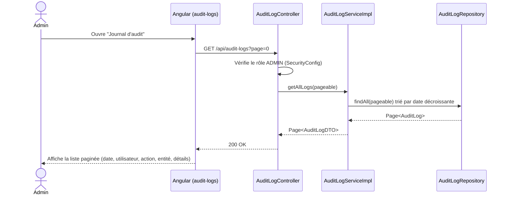

### 5.7 Alerte de stock quotidienne par email

```mermaid
sequenceDiagram
    participant CRON as StockAlerteScheduler
    participant NS as NotificationServiceImpl
    participant DS as DashboardServiceImpl
    participant MAIL as JavaMailSender (SMTP)

    Note over CRON: Déclenchement automatique quotidien (cron configurable, 8h00 par défaut)
    CRON->>NS: envoyerAlerteStock()
    NS->>DS: getRupturesStock()
    DS-->>NS: Liste des produits en rupture / stock bas

    alt Liste vide
        NS-->>CRON: Ne fait rien (aucun mail envoyé)
    else Au moins un produit concerné
        NS->>NS: Sépare rupture imminente (quantité = 0) et stock bas (quantité > 0)
        NS->>NS: Construit le corps du message (texte brut)
        NS->>MAIL: send(message)
        alt Envoi réussi
            MAIL-->>NS: OK
        else Échec (SMTP indisponible, mal configuré...)
            MAIL-->>NS: Exception
            NS-->>CRON: Exception propagée
            CRON->>CRON: Capture l'exception, journalise un avertissement
            Note over CRON: L'échec n'interrompt jamais l'application ;\nnouvelle tentative au prochain déclenchement planifié
        end
    end
```

Un déclenchement manuel est également possible via `POST /api/notifications/test-alerte-stock` (réservé au rôle `ADMIN`), pour vérifier le comportement sans attendre l'horaire planifié.

### 5.8 Archivage de la facture PDF côté serveur

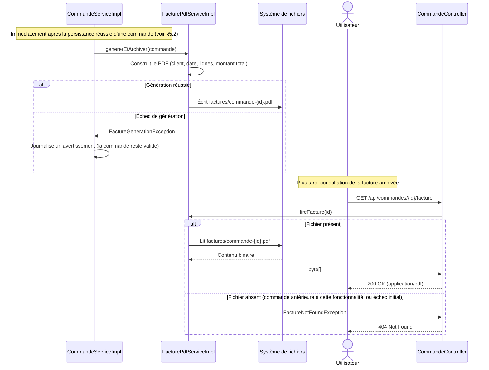

Cette génération serveur est volontairement indépendante de la facture déjà produite côté client (jsPDF, voir §7.5) : l'une répond au besoin immédiat du caissier (téléchargement instantané), l'autre garantit qu'un document existe et reste consultable même si personne ne l'a téléchargée au moment de la vente — utile pour un archivage fiable ou un contrôle a posteriori.

---

## 6. Diagramme d'activité — cycle de vente et de réapprovisionnement

Ce diagramme illustre le processus métier global reliant la vente (qui consomme du stock) et l'achat fournisseur (qui le reconstitue), déclenché par les alertes du tableau de bord et relayé automatiquement par email.

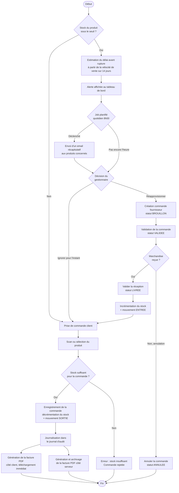

---

## 7. Captures d'écran commentées

Les images référencées ci-dessous sont disponibles dans le dossier [`screenshots/`](../screenshots/) à la racine du dépôt. Les chemins sont relatifs à l'emplacement de ce document dans `docs/`.

### 7.1 Authentification

**Écran de connexion**


Écran d'accueil en deux colonnes : un bandeau de présentation de l'application à gauche (nom, tagline, principaux modules) et le formulaire de connexion à droite (identifiant, mot de passe avec option d'affichage, bouton « Se connecter »). Correspond à la route publique `/auth/login`, seule route accessible sans token JWT avec la documentation Swagger.

### 7.2 Tableau de bord

**Vue générale — indicateurs clés (mode clair)**


Vue d'ensemble du tableau de bord : compteurs globaux (clients, produits, commandes, chiffre d'affaires avec variation par rapport au mois précédent), puis répartition du chiffre d'affaires par période (journalier, hebdomadaire, mensuel, annuel), et enfin trois indicateurs qualitatifs (meilleur client, produit le plus vendu, catégorie la plus populaire). Ces données sont calculées côté serveur par `DashboardServiceImpl` et exposées via `DashboardController`.

**Vue générale — indicateurs clés (mode sombre)**


Le même écran en thème sombre, géré par `theme.service.ts` côté frontend — une bascule clair/sombre est disponible dans la barre de navigation, sans rechargement de page.

**Graphiques et alertes de stock**


Partie basse du tableau de bord : évolution du chiffre d'affaires sur 12 mois (courbe Chart.js), répartition des ventes par catégorie (graphique en anneau), classement des 10 produits les plus vendus, nombre de nouveaux clients sur 30 jours, et alertes de stock à deux niveaux distincts — **« Rupture imminente »** (quantité à 0) en rouge et **« Stock bas »** (quantité sous le seuil) en orange. Le délai avant épuisement affiché (ex. « Épuisement estimé : ~42 jours ») n'est plus un texte générique : il est calculé à partir de la vélocité de vente réelle du produit sur les 14 derniers jours (voir §5.5 pour le détail du calcul). Lorsque l'historique de ventes récent est insuffisant pour estimer un rythme fiable, l'application l'indique explicitement (« Vélocité de vente insuffisante pour estimer ») plutôt que d'afficher un chiffre trompeur.

### 7.3 Gestion des clients

**Formulaire — création**


Formulaire d'ajout d'un nouveau client, avec message de confirmation « Client ajouté avec succès ! » après enregistrement. Les champs Nom, Prénom, Email et Téléphone sont obligatoires (visible ici : les erreurs de validation s'affichent sous chaque champ tant qu'il n'est pas rempli correctement, y compris juste après un enregistrement réussi si le formulaire est réutilisé pour une nouvelle saisie).

**Formulaire — modification**


Formulaire client réutilisé à l'identique pour la création et la modification, avec validations en temps réel (nom et prénom obligatoires, format d'email, téléphone à exactement 10 chiffres). Le message de succès en tête de page (« Client mis à jour avec succès ! ») confirme l'action ; les messages d'erreur sous chaque champ apparaissent uniquement si la validation échoue.

**Liste des clients**


Tableau paginé (5 éléments par page ici) avec barre de recherche instantanée, export Excel (`excel-export.service.ts` / ExcelJS), et actions « Modifier » / « Supprimer » par ligne. La suppression déclenche une désactivation logique du client (`actif = false`) plutôt qu'une suppression physique, ce qui préserve l'historique de ses commandes passées.

**Confirmation de suppression**


Message de confirmation après suppression logique d'un client, avant retour au formulaire de création.

### 7.4 Catalogue produits

**Formulaire — création**


Formulaire d'ajout d'un produit : nom, prix (FCFA), description, quantité en stock initiale, catégorie (utilisée pour la ventilation des ventes par catégorie du tableau de bord) et code-barres / QR code optionnel. Le message d'erreur « Le prix doit être supérieur à 0 » illustre la validation métier appliquée avant l'appel à l'API.

**Formulaire — modification**


Même formulaire réutilisé pour la modification, avec confirmation « Produit mis à jour avec succès ! ».

**Réapprovisionnement rapide**


Action dédiée « Réapprovisionner » accessible depuis la liste des produits, permettant d'ajouter directement une quantité au stock existant sans passer par une commande fournisseur formelle (utile pour un ajustement manuel ou un inventaire). Chaque réapprovisionnement génère également un mouvement de stock de type `ENTREE` dans l'historique.

**Liste des produits**


Catalogue paginé avec recherche, bouton « Scanner un produit » (ouvre le composant `scanner-code-barres` pour retrouver un produit par sa caméra), export Excel, et actions Modifier / Réapprovisionner / Supprimer par ligne. La colonne Quantité utilise un badge coloré pour une lecture rapide de l'état du stock.

### 7.5 Ventes — prise de commande et facturation

**Prise de commande**


Écran de prise de commande : sélection du client, ajout de produits soit via une liste déroulante, soit via le bouton « Scanner un produit » (webcam), saisie de la quantité, calcul automatique du sous-total par ligne et du montant total. Correspond au flux détaillé en §5.2.

**Liste des commandes et facturation**


Historique des ventes avec statut (« Validée »), montant, et deux actions par ligne : téléchargement de la facture PDF (générée côté client avec jsPDF + jspdf-autotable, sans aller-retour serveur supplémentaire) et annulation de la commande (restitution automatique du stock, voir §5.3). Un bouton « Exporter les ventes » permet un export Excel de l'ensemble des commandes affichées.

### 7.6 Stock — historique des mouvements

**Historique des mouvements de stock**


Vue consolidée de tous les mouvements de stock, qu'ils soient automatiques (vente → `SORTIE`, réception fournisseur → `ENTREE`, annulation → `ENTREE`) ou manuels (réapprovisionnement direct). Chaque ligne indique la date, le produit, le type de mouvement, la quantité et un motif traçant son origine (ex. « Vente - Commande #21 », « Réception commande fournisseur #CF-2026-0001 »), ce qui permet de reconstituer entièrement l'historique d'un produit.

### 7.7 Fournisseurs

**Écran fournisseurs — création**


**Écran fournisseurs — modification**


**Liste des fournisseurs**


Gestion des fournisseurs (raison sociale, email, téléphone, adresse) avec recherche, modification et suppression logique — même principe que pour les clients, afin de préserver l'historique des commandes fournisseur déjà passées.

**Confirmation de suppression**


### 7.8 Achats fournisseurs — cycle de validation

**Création d'une commande fournisseur**


Sélection du fournisseur, ajout de produits avec quantité et **prix d'achat unitaire** (distinct du prix de vente catalogue), calcul automatique du montant total. À l'enregistrement, la commande est créée avec le statut initial `BROUILLON`.

**Suivi des commandes d'achat**


Liste des commandes fournisseurs avec leur référence générée automatiquement (`CF-2026-000X`), leur statut (Validée / Annulée / Livrée, chacun avec un code couleur dédié), et des actions contextuelles selon le statut : une commande validée peut être réceptionnée (« Valider la réception », qui incrémente le stock — voir §5.4) ou annulée ; une commande déjà livrée ou annulée n'affiche plus d'action, conformément aux règles de transition de statut appliquées côté serveur.

### 7.9 Journal d'audit

**Journal d'audit**


Vue paginée de toutes les actions de création, modification et suppression tracées par l'application (69 actions enregistrées sur cette capture), avec la date, l'utilisateur, le type d'action (code couleur : vert pour création, jaune pour modification, rouge pour suppression), l'entité concernée et une description lisible de l'action. Cet écran est réservé au rôle `ADMIN` (voir §4.2).

### 7.10 Vérifications techniques — sécurité, archivage et notifications

Les captures suivantes ne montrent pas un écran applicatif destiné à l'utilisateur final, mais documentent la vérification concrète de trois mécanismes internes présentés plus haut dans ce document.

**En-tête d'autorisation JWT (DevTools réseau)**


Onglet Réseau des outils de développement du navigateur, montrant l'en-tête `Authorization: Bearer <token>` attaché automatiquement à chaque requête vers l'API par `jwt.interceptor.ts` (voir §5.1). Cette vérification confirme que l'intercepteur fonctionne réellement pour tous les appels (produits, clients, commandes, historique de stock...), sans qu'il soit nécessaire de le répéter dans chaque service Angular.

**Archivage de la facture PDF côté serveur**


Contenu du dossier `factures/` sur le serveur après deux ventes successives : les fichiers `commande-22.pdf` et `commande-23.pdf` ont été générés et archivés automatiquement, sans action de l'utilisateur, conformément au flux décrit en §5.8. Chaque PDF reprend le client, la date, les lignes de la commande et le montant total.

**Alerte de stock reçue par email**


Email réellement reçu, déclenché par le job planifié quotidien (voir §5.7), listant les produits en rupture (« Telephone iphone 14 Pro », stock à 0) et en stock bas (« Chargeur Dell », quantité restante : 8). À noter : lors de ce test, le message a été classé par le fournisseur de messagerie dans le dossier spam — un comportement attendu pour une adresse d'expédition sans historique d'envoi (voir §8.2 pour les pistes d'amélioration de la délivrabilité).

### 7.11 Couverture de tests automatisés

Deux suites de tests automatisés accompagnent le code applicatif, l'une par couche technique :

| Côté | Outils | Ce qui est couvert |
|---|---|---|
| **Backend** | JUnit 5, Mockito, AssertJ | Calcul de vélocité de vente et estimation du délai avant rupture (`DashboardServiceImplTest`, y compris le cas « aucune vente récente ») ; envoi conditionnel de l'alerte stock, avec vérification qu'aucun email n'est envoyé si la liste de ruptures est vide (`NotificationServiceImplTest`) |
| **Frontend** | Vitest (via `@angular/build:unit-test`, le builder de test natif d'Angular) | Calcul du montant d'une commande (`commande-list.spec.ts`), présence de l'en-tête `Authorization` sur les requêtes API et son absence hors de l'API (`jwt.interceptor.spec.ts`), redirection en cas d'authentification ou de rôle insuffisant (`auth.guard.spec.ts`, `role.guard.spec.ts`), formation correcte des appels HTTP des services (`produit.service.spec.ts`, `commande.service.spec.ts`) |

À l'exécution (`npm test -- --watch=false` côté frontend), l'ensemble de la suite frontend passe : 12 fichiers de tests, 43 tests, tous au vert.

---

## 8. Choix techniques et difficultés rencontrées

### 8.1 Choix techniques justifiés

- **Suppression logique généralisée** (`Client`, `Produit`, `Fournisseur`) : évite les erreurs d'intégrité référentielle (HTTP 409) lors de la suppression d'une ressource déjà référencée par des commandes passées, tout en conservant l'historique intact.
- **Séparation Commande / CommandeFournisseur** : bien que les deux entités partagent une structure similaire (commande + lignes + produit), elles ont été gardées distinctes plutôt que factorisées en une entité générique, car leurs règles de gestion diffèrent fondamentalement (une vente impacte le stock immédiatement à la création ; un achat ne l'impacte qu'à la réception, après un cycle de validation en plusieurs étapes).
- **Double génération de la facture PDF** : une génération côté client (jsPDF), pour un téléchargement immédiat sans aller-retour serveur au moment de la vente, et une génération côté serveur (OpenPDF), déclenchée automatiquement et archivée sur le disque, pour garantir qu'un document existe et reste consultable même si la facture n'a jamais été téléchargée. Les deux répondent à des besoins différents plutôt que de faire doublon : l'une est un confort d'usage, l'autre une garantie d'archivage.
- **Stockage des factures sur le système de fichiers plutôt qu'en base** : plus simple à mettre en place et à faire évoluer (sauvegarde, purge, migration vers un stockage objet type S3 le cas échéant) qu'une colonne binaire en base de données, au prix d'une dépendance au système de fichiers du serveur — acceptable pour une application à instance unique, à réévaluer si une architecture multi-instances devenait nécessaire.
- **Isolation du job planifié (`StockAlerteScheduler`) du service métier (`NotificationServiceImpl`)** : le service métier ne dépend pas du contexte de planification Spring, ce qui le rend testable unitairement sans avoir à simuler l'écoulement du temps.
- **Email d'alerte en texte brut plutôt qu'en HTML** : plus fiable face aux filtres anti-spam pour un envoi automatisé, et suffisant pour une alerte interne à visée purement informative.
- **`Optional<Integer>` pour l'estimation du délai avant rupture** : une vélocité de vente nulle rend l'estimation indéterminée (délai infini). Retourner `Optional.empty()` force l'appelant à traiter explicitement ce cas, plutôt qu'une valeur sentinelle (`-1`, `Integer.MAX_VALUE`...) qu'il serait facile d'oublier de vérifier et d'afficher par erreur comme un chiffre valide.
- **DTOs découplés des entités JPA** : les contrôleurs n'exposent jamais directement les entités `@Entity`, ce qui évite les problèmes classiques de sérialisation JSON sur les relations bidirectionnelles (boucles infinies) et permet de faire évoluer le modèle de données sans casser le contrat d'API.
- **JWT stateless** : cohérent avec une architecture purement API REST consommée par une SPA Angular, sans dépendance à une session serveur qui compliquerait un déploiement à plusieurs instances.

### 8.2 Difficultés rencontrées et solutions apportées

- **Contrainte d'unicité sur le code-barres avec valeur optionnelle** : la colonne `code_barre` du produit est à la fois `unique` et facultative. Deux chaînes vides (`""`) ne sont pas considérées distinctes par PostgreSQL sous une contrainte `UNIQUE`, contrairement à deux valeurs `NULL`. Le setter `Produit.setCodeBarre(...)` normalise donc toute chaîne vide ou blanche en `null` avant persistance, pour permettre à plusieurs produits sans code-barres de coexister.
- **Migration de schéma sans casser les données existantes** : en `ddl-auto=update`, l'ajout d'une colonne `NOT NULL` sur une table déjà peuplée fait échouer la migration. Pour `StatutCommande` (ajouté après coup), la colonne a volontairement été laissée nullable, et le service traite une valeur `null` en base comme équivalente à `VALIDE` — une commande existante sans statut explicite reste donc annulable normalement.
- **Restitution du stock lors d'une annulation ou d'une suppression de commande** : il fallait s'assurer que le stock recrédité et le mouvement de stock journalisé restent cohérents même en cas d'erreur partielle — la méthode est marquée `@Transactional` pour garantir que la mise à jour du stock, la persistance du mouvement et le changement de statut réussissent ou échouent ensemble.
- **Cohérence entre stock du catalogue et historique des mouvements** : chaque opération qui modifie `Produit.quantite` (vente, annulation, réapprovisionnement manuel, réception fournisseur) doit systématiquement générer une ligne `MouvementStock` correspondante, afin que l'historique reste une source de vérité exhaustive plutôt qu'un simple complément.
- **Cohérence des autorisations entre frontend et backend** : les guards Angular (`auth.guard`, `role.guard`) empêchent l'accès à une route côté client, mais ne constituent qu'un confort d'ergonomie — toute règle de rôle a été dupliquée et vérifiée en priorité côté serveur dans `SecurityConfig`, seule source de vérité en matière de sécurité.
- **Délivrabilité des emails automatisés** : lors du premier test réel d'envoi, l'email d'alerte s'est retrouvé classé en spam par le destinataire. C'est un comportement attendu pour une adresse d'expédition récente sans historique d'envoi ni configuration DNS avancée (SPF/DKIM) — non un défaut du code. Pour un déploiement réel au-delà d'une démonstration, ce point demanderait soit l'authentification du domaine d'envoi, soit le recours à un service d'envoi transactionnel dédié plutôt qu'une boîte Gmail standard.
- **Non-blocage de la commande en cas d'échec d'un traitement annexe** : l'archivage de la facture PDF et l'envoi de l'alerte stock sont tous deux conçus pour échouer silencieusement (journalisation d'un avertissement) sans jamais faire échouer l'opération métier principale (respectivement la création d'une commande, le déclenchement planifié suivant). Ce choix a demandé de bien séparer, dans le code, ce qui doit interrompre une transaction de ce qui peut simplement être retenté ou ignoré.
- **Test unitaire d'un calcul dépendant du temps** : `calculerVelociteVente` se base sur une fenêtre glissante (`LocalDateTime.now().minusDays(...)`), ce qui rend le test fragile si l'on fige une date en dur. Le test a donc été écrit en simulant directement la valeur retournée par le repository (`sumSortiesDepuis`), sans dépendre de l'horloge système.

---

## 9. Perspectives d'évolution

Les points suivants ne sont pas implémentés dans la version actuelle et constituent des axes d'évolution identifiés :

- **Gestion multi-dépôt** : le stock est actuellement géré de façon globale par produit ; une évolution vers plusieurs points de stockage impliquerait de ventiler la quantité par dépôt et d'ajouter une notion de transfert inter-dépôts.
- **Gestion multi-devise** : tous les montants sont actuellement exprimés en FCFA sans notion de taux de change ; une internationalisation nécessiterait une entité Devise et une conversion à l'affichage comme à la facturation.
- **Amélioration de la délivrabilité des emails d'alerte** : authentification du domaine d'envoi (SPF/DKIM) ou recours à un service d'envoi transactionnel dédié, pour éviter que les alertes automatiques ne soient classées en spam par le destinataire (voir §8.2).
- **Prévisions de vente au-delà de la simple vélocité glissante** : l'estimation actuelle du délai avant rupture (§5.5) est volontairement simple ; un modèle tenant compte de la saisonnalité ou des tendances de vente affinerait l'estimation pour les produits à la demande irrégulière.
- **Notification en cas d'échec d'archivage de facture** : aujourd'hui, un échec de génération PDF côté serveur est uniquement journalisé côté serveur ; un signalement visible à un administrateur (plutôt qu'un simple log) permettrait de détecter plus vite une facture manquante.
- **Gestion fine des permissions** : les trois rôles actuels (Admin, Gestionnaire, Caissier) couvrent les besoins actuels ; une évolution vers des permissions plus granulaires (par exemple, un gestionnaire limité à certaines catégories de produits) pourrait être envisagée si l'équipe utilisatrice grandit.
- **Tests end-to-end** : la couverture actuelle (backend et frontend, voir §7.10) porte sur des tests unitaires ; l'ajout de tests de bout en bout (ex. Playwright ou Cypress) sur les parcours critiques (prise de commande complète, cycle achat fournisseur) renforcerait la confiance sur les régressions d'intégration.

---

*Les diagrammes de ce document sont écrits en syntaxe Mermaid et se rendent nativement dans la plupart des visualiseurs Markdown (GitHub, GitLab, VS Code avec l'extension appropriée).*
